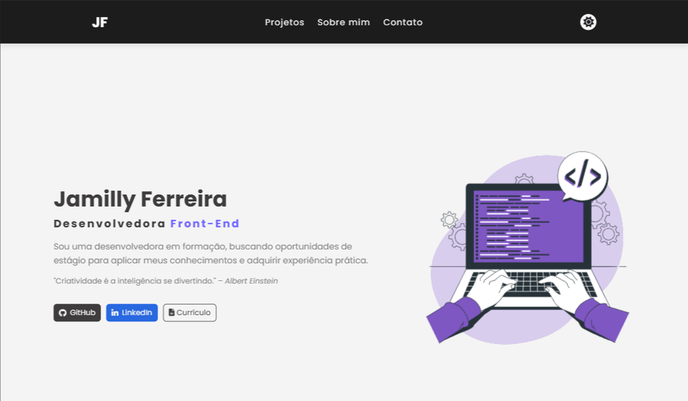

# 💻 Portfólio - Jamilly Ferreira

Bem-vindo(a) ao meu portfólio! Aqui você vai encontrar os projetos que desenvolvi com muito carinho, café e código. ☕🚀



## 📝 Sobre

Sou estudante de **Análise e Desenvolvimento de Sistemas** apaixonada por criar experiências web intuitivas e funcionais. Desenvolvo interfaces com foco em usabilidade e boas práticas de programação, buscando sempre aprender novas tecnologias e aprimorar minhas habilidades. Este portfólio reúne meus principais projetos front-end e demonstra minha jornada de evolução técnica.


## 🚀 Tecnologias utilizadas

- HTML5 semântico
- CSS3 com design responsivo
- JavaScript para interatividade
- Font Awesome para ícones
- Biblioteca AOS para animações de scroll
- Git/GitHub para versionamento
- Vercel para deploy


## 🗂️ Estrutura do projeto

O projeto foi estruturado de forma organizada, com separação clara de responsabilidades:

```
portfolio/
├── assets/
│   ├── css/         # Arquivos de estilo
│   ├── images/      # Imagens dos projetos
│   └── js/          # Scripts JavaScript
├── index.html       # Página principal
├── about.html       # Página sobre
├── *.html           # Outras páginas
└── README.md        # Documentação

```


## 💼 Projetos incluídos

✅ **Todo List**:

Aplicação de lista de tarefas com funcionalidades para adicionar, marcar e excluir tarefas. Desenvolvida com JavaScript puro, utilizando localStorage para persistência de dados.

[Ver projeto](https://todo-list-tau-self.vercel.app/) | [Repositório](https://github.com/jamillyferreira/todo-list)

🛒 **Carrinho Doce**

Sistema de e-commerce simplificado com catálogo de produtos e carrinho de compras dinâmico. Implementado com JavaScript moderno e manipulação avançada do DOM.

[Ver projeto](https://product-list-with-cart-eosin.vercel.app/) | [Repositório](https://github.com/jamillyferreira/product-list-with-cart)

🍔 **Dev Burguer**

Cardápio digital interativo para restaurante com interface amigável, carrinho de compras dinâmico e integração com WhatsApp para finalização de pedidos. Desenvolvido com foco em experiência do usuário.

[Ver projeto](https://digital-menu-cart.vercel.app/) | [Repositório](https://github.com/jamillyferreira/digital-menu-cart)

👩‍💻 **Devfinder**

Desenvolvido como desafio do site [Frontend Mentor](https://www.frontendmentor.io/), este projeto consome a API pública do GitHub para exibir perfis de desenvolvedores com foco em **busca dinâmica**.

[Ver projeto](https://devfinder-cyan.vercel.app/) | [Repositório](https://github.com/jamillyferreira/devfinder)


## 🚀 Como visualizar o portfólio

Você pode acessar o portfólio online aqui:  
👉 [https://jamillyferreira.vercel.app/](https://jamillyferreira.vercel.app/)

Para rodar localmente:

1. Clone o repositório:

```bash
git clone https://github.com/jamillyferreira/portfolio-jamilly-ferreira.git
```

2. Abra o arquivo `index.html` no seu navegador


## 📊 Funcionalidades

- **Design responsivo**: Adaptação perfeita para diferentes tamanhos de tela
- **Navegação intuitiva**: Menu de fácil acesso para todas as seções
- **Animações sutis**: Elementos que aparecem conforme o scroll da página
- **Modo escuro/claro**: Opção de alternar entre temas
- **Exibição detalhada de projetos**: Cards interativos com links para demonstrações


## 📞 Contato

Me chama pra conversar, trocar ideia ou recrutar 😁

- LinkedIn: [linkedin.com/in/jamillyferreira](https://www.linkedin.com/in/jamillyferreira/)
- GitHub: [github.com/jamillyferreira](https://github.com/jamillyferreira)
- E-mail: jamillyferreira039@gmail.com


## 🔄 Status do projeto

🚧 Em desenvolvimento contínuo - Novos projetos são adicionados regularmente!
---
⭐ Feito com dedicação por Jamilly Ferreira - 2025
